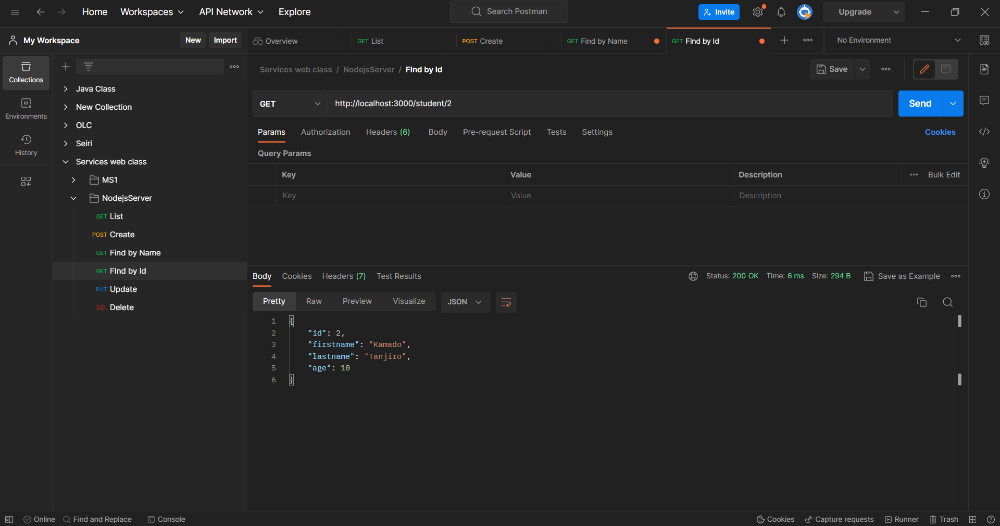

# Nodejs Express Rest API

This repo contain the code for a simple Rest API that handles a student resource by performing the following operations:

- Create a student
- Get the students list
- Update a student informations
- Delete a student
- Find a student by Its ID
- Find a student by its first or last name

The user informations are **id, firstname, lastname and age**.

## Packages

- [Express](https://expressjs.com/fr/) to build the server.
- [Nodemon](https://www.npmjs.com/package/nodemon) to reload the server when a file is updated.

## How to run the project

- Clone the project by running the command below

```
    git clone git@github.com:niemet0502/nodejs-express-server.git
```

- Move inside the folder

```
    cd nodejs-express-server
```

- Install dependencies

```
    npm install
```

- Run the project

```
    npm run start
```

The server will start listening on the **3000** PORT.

## Demo

### GET the list


### Create a student


### Find by Id



### Update


### Find by Name


The demo abose uses [Postman](https://www.postman.com/) to test the Rest API.
